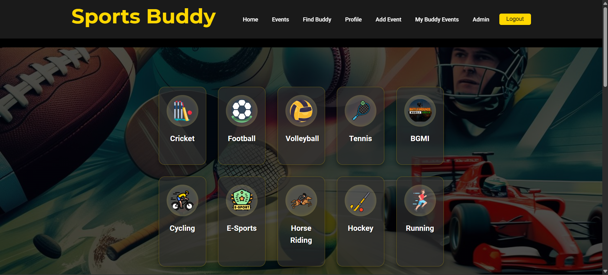

# 🏅 Sports Buddy

### 🔗 [Live Demo](https://sport-buddy-daee1.web.app/)

## Find Your Perfect Sports Partner & Events!

**Sports Buddy** is a dynamic web application designed to connect sports enthusiasts. Whether you're looking for a casual game, a training partner, or exciting local sports events, **Sports Buddy** helps you discover, join, and organize sporting events effortlessly.

---

## ✨ Features

- 🎯 **Browse Sports Categories** – Filter events and find buddies based on your preferred sport (Football, Cricket, Volleyball, E-Sports, etc.).
- 📆 **Discover Upcoming Events** – View and explore live sports events in your location.
- ✅ **Join / Leave Events** – Manage your participation in events easily.
- 📝 **Create Your Own Events** – Organize and host games, tournaments, and meetups.
- 🧑‍🤝‍🧑 **Find Buddies** – Connect with people who love the same sports.
- 👤 **User Profiles** – Manage personal details and event history.
- 🔐 **Authentication** – Secure login and registration with Firebase Auth.
- 🛠 **Admin Dashboard (Beta)** – Modular dashboard for restricted user(s) like `admin@sportsbuddy.com`.
- 📱 **Responsive Design** – Mobile-friendly and works across all devices.
- 🔔 **Real-time Notifications** – For logins, RSVP actions, and updates.
- 🧭 **Smooth UI Navigation** – Auto-scroll to selected sports sections on the home page.

---

## 🚀 Technologies Used

### ⚛ Frontend
- **React.js**
- **React Router DOM**
- **HTML**
- **CSS**
- **Vite.js**

### ☁ Backend & Database
- **Firebase**
  - 🧾 **Authentication**
  - 🔥 **Firestore Database**
  - ⚙️ (config via `.env.local`)

